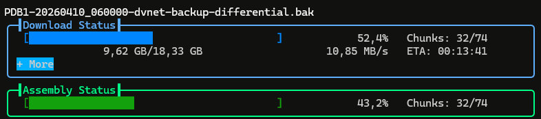
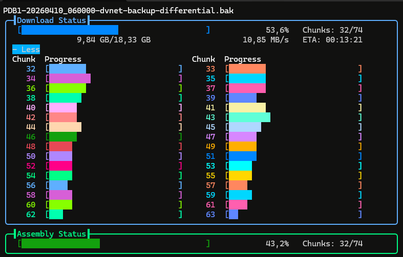
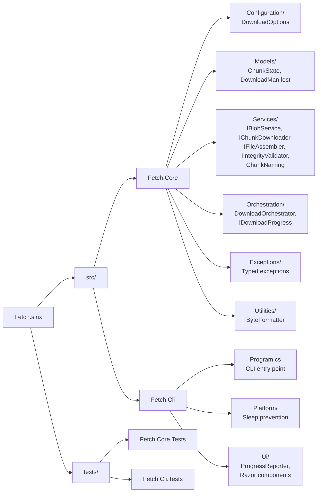

# Fetch



A .NET 9 console application that downloads large files from Azure Blob Storage using parallel, chunked, resumable downloads with a live-updating terminal progress display.



## Features

- **Parallel chunked downloads** — splits large blobs into one chunk per concurrent thread (capped at 256 MB) and downloads them in parallel
- **Resumable** — persists download state to a manifest file; interrupted downloads continue where they left off
- **Queue downloads** — pass multiple URLs to download sequentially in a single invocation
- **Hidden chunk files** — chunk and manifest files are hidden by default (dot-prefixed, `FILE_ATTRIBUTE_HIDDEN` on Windows)
- **Safe assembly** — output file uses a `.part` extension during assembly, renamed to final name only after integrity validation
- **MD5 integrity validation** — verifies the assembled file against the blob's content hash
- **Live progress display** — real-time progress bar with speed, ETA, and chunk status
- **Sleep prevention** — prevents Windows from sleeping during long downloads
- **Configurable** — chunk size, concurrency, output path, and authentication method

## Prerequisites

- [.NET 9 SDK](https://dotnet.microsoft.com/download/dotnet/9.0) or later
- An Azure Blob Storage account with a blob to download
- Authentication: a storage account key, credentials configured for [DefaultAzureCredential](https://learn.microsoft.com/en-us/dotnet/azure/sdk/authentication/), or interactive browser login

## Building

```bash
dotnet build Fetch.slnx
```

## Running Tests

```bash
dotnet test Fetch.slnx
```

## Usage

```text
fetch <urls>... [options]

Arguments:
  <urls>   One or more Azure Blob Storage URLs

Options:
  -o, --output <path>        Output file or directory [default: current directory]
  -k, --key <key>            Storage account key (omit for automatic credential detection)
  -c, --concurrency <n>      Max parallel chunk downloads [default: min(CPU * 4, 32)]
  -s, --chunk-size <mb>      Max chunk size in MB (cap) [default: 256]
  --WaitForDownload          Download all chunks before assembling (disables streaming assembly)
  --ShowChunks               Show chunk and manifest files (do not hide them)
  --debug                    Write download manifest after each chunk
  --version                  Show version
  -h, --help                 Show help
```

### Examples

Download a blob to the current directory (uses DefaultAzureCredential, falling back to interactive browser login):

```bash
dotnet run --project src/Fetch.Cli -- "https://myaccount.blob.core.windows.net/mycontainer/largefile.zip"
```

Download with a storage account key to a specific directory:

```bash
dotnet run --project src/Fetch.Cli -- "https://myaccount.blob.core.windows.net/mycontainer/largefile.zip" \
  -k "your-storage-account-key" \
  -o "D:\Downloads"
```

Download with custom concurrency and chunk size:

```bash
dotnet run --project src/Fetch.Cli -- "https://myaccount.blob.core.windows.net/mycontainer/largefile.zip" \
  -c 64 -s 128 -o "output.zip"
```

Download multiple files in sequence:

```bash
fetch "https://myaccount.blob.core.windows.net/mycontainer/file1.zip" \
      "https://myaccount.blob.core.windows.net/mycontainer/file2.zip" \
      "https://myaccount.blob.core.windows.net/mycontainer/file3.zip" \
  -o "D:\Downloads"
```

Queue downloads from a script variable (PowerShell):

```powershell
$uris = @(
  "https://myaccount.blob.core.windows.net/mycontainer/file1.zip",
  "https://myaccount.blob.core.windows.net/mycontainer/file2.zip"
)
fetch $uris -o "D:\Downloads"
```

Queue downloads from a script variable (Bash):

```bash
uris=(
  "https://myaccount.blob.core.windows.net/mycontainer/file1.zip"
  "https://myaccount.blob.core.windows.net/mycontainer/file2.zip"
)
fetch "${uris[@]}" -o ~/downloads
```

### Authentication

When no `-k` storage account key is provided, Fetch tries the following credential methods in order:

1. **DefaultAzureCredential** — environment variables, managed identity, Visual Studio, Azure CLI, Azure PowerShell, and Azure Developer CLI
2. **Interactive browser login** — opens a browser window for Azure sign-in (2-minute timeout)

If all methods fail (or the browser login times out), the download exits with an error.

### Chunking Strategy

By default, the file is divided into `file size / concurrency` sized chunks so that every download thread gets work immediately. The `--chunk-size` option acts as a **cap** — if the computed chunk size exceeds it, the cap is used instead (which may produce more chunks than threads, with the surplus queued).

For example, a 4 GB file with 16 threads produces 16 chunks of 256 MB each. A 16 GB file with 16 threads would compute 1 GB chunks, but the 256 MB default cap limits them to 256 MB, yielding 64 chunks that are processed 16-at-a-time.

### Hidden Chunk Files

By default, chunk files and the download manifest are hidden:

- Filenames are dot-prefixed (e.g., `.largefile.zip.000001`, `.largefile.zip.fetch-manifest.json`)
- On Windows, the `Hidden` file attribute is also set

Use `--ShowChunks` to keep chunk and manifest files visible (no dot prefix, no hidden attribute). When resuming a download with a different `--ShowChunks` setting, existing files are automatically migrated (renamed and re-attributed) to match.

### Partial File Safety

During assembly, the output file is written with a `.part` extension (e.g., `largefile.zip.part`). The `.part` extension is removed only after successful integrity validation. If a download is interrupted during assembly, the `.part` file is preserved and will be resumed on the next run.

### Resume

If a download is interrupted, simply re-run the same command. Fetch detects the manifest file next to the output location and resumes from where it left off. If the blob has changed since the previous attempt, the stale state is discarded and the download starts fresh.

### Queue Downloads

Pass multiple URLs to download them sequentially in a single invocation. Each URL goes through the full download lifecycle independently. If one download fails, the remaining URLs still proceed. The exit code is non-zero if any download failed.

## Project Structure



## Architecture

The core library (`Fetch.Core`) is fully decoupled from the console UI:

- **`IBlobService`** — abstracts Azure Blob SDK operations behind a testable interface
- **`IChunkDownloader`** — downloads a single chunk with retry and exponential backoff
- **`IFileAssembler`** — assembles chunk files into the final output using `RandomAccess` (lock-free parallel writes)
- **`IIntegrityValidator`** — validates file integrity via MD5 hash
- **`DownloadOrchestrator`** — coordinates the full download lifecycle
- **`IDownloadProgress`** — push-based progress reporting interface for UI decoupling

All dependencies are injected via `Microsoft.Extensions.DependencyInjection`, making the system testable and extensible.
